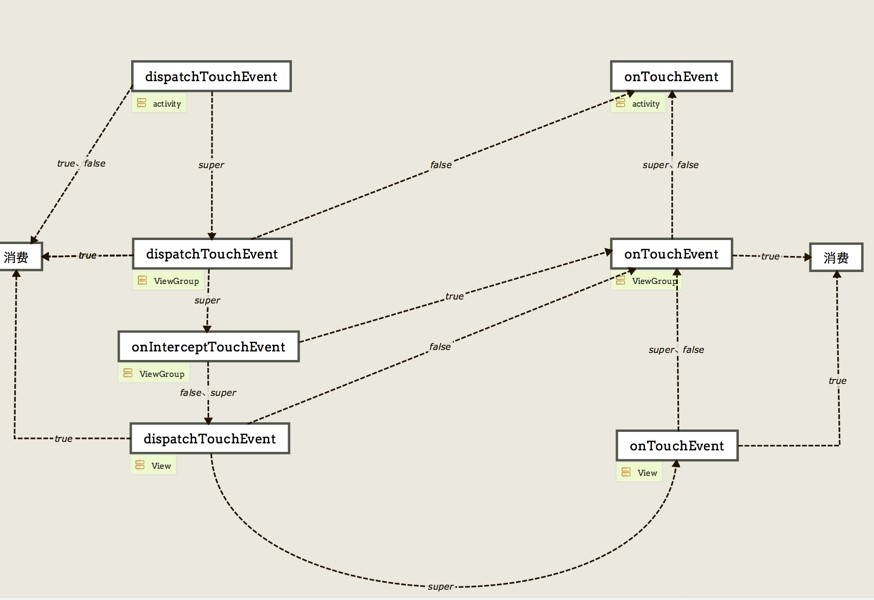

##### 概述
事件分发的对象：Activity，ViewGroup，View
涉及到三个函数：dispatchTouchEvent, onInterceptTouchEvent, onTouchEvent
事件传递的方向是一个U型图。

##### dispatchTouchEvent
无论是ViewGroup还是View，事件分发的入口都是dispatchTouchEvent。
返回true，则事件被消费，停止传递；返回false，则事件传递给上一层的onTouchEvent方法处理；调用super的话，对于ViewGroup来说，会继续调用自身的onInterceptTouchEvent判断是否进行拦截，而对于View来说，会调用自身的onTouchEvent进行处理。

##### onInterceptTouchEvent
只在ViewGroup中存在，用来判断是否对事件进行拦截处理。
返回true，表示需要拦截，则调用ViewGroup自身的onTouchEvent处理；返回false或调用super都表示不拦截，会将事件传递给下一层。

##### onTouchEvent
事件的最终处理方法，ViewGroup和View都存在此方法。
返回true，表示消费事件；返回false或调用super都是将事件传递给上一层的onTouchEvent方法进行处理。